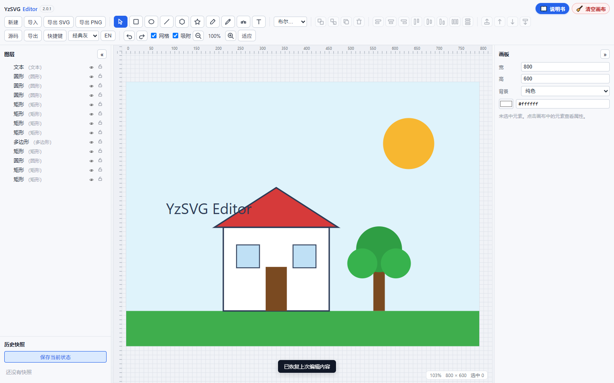
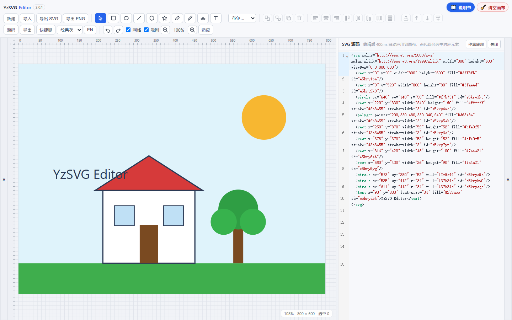
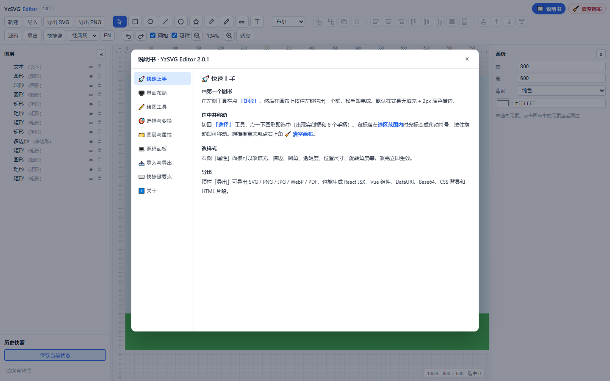

# 🎨 YzSVG Editor

**纯前端、可离线双击运行的 SVG 矢量编辑器**

画图形 · 改节点 · 调属性 · 看源码 · 一键导出

     

> **作者：Cherish-RSran**　·　邮箱：`rs.cherishran@gmail.com`

---

## 目录

- [这是什么](#这是什么)
- [界面一览](#界面一览)
- [三种用法，挑一个开始](#三种用法挑一个开始)
- [功能一览](#功能一览)
- [目录结构](#目录结构)
- [本地开发与二次开发](#本地开发与二次开发)
- [部署上线](#部署上线)
- [常见问题](#常见问题)
- [作者与许可](#作者与许可)

---

## 这是什么

**YzSVG Editor** 是一个完全跑在浏览器里的 SVG 矢量编辑器：没有后端、没有账号、不上传任何文件。所有计算（几何、布尔运算、序列化）和所有存储（自动保存、历史快照）都在你自己的浏览器里完成。

它的定位是「**打开就能画，画完就能拿走干净的 SVG 代码**」：

- **无损**：画布用原生 SVG DOM 渲染，导入什么就看到什么，导出什么就得到什么，不会出现「预览和结果不一样」
- **看得见代码**：内置源码面板，画布与 SVG 源码双向实时同步，在代码里改也能回灌到画布
- **一份文件就能带走**：构建产物是「一个 HTML + 一份 JS」，双击即开、可离线、可放 U 盘、可直接丢给同事
- **不制造垃圾**：不联网、不注册、不产生任何账号数据，关掉浏览器数据只留在你本机

技术栈：React 18 + TypeScript 5.6（strict）+ Vite 5，状态是约 40 行的自研 store（`useSyncExternalStore`）+ 命令模式撤销栈，源码编辑用 CodeMirror 6，导出用到 svgo / jspdf + svg2pdf.js，持久化用 IndexedDB。

---

## 界面一览



*主界面：左侧图层与快照 · 中间画布 · 右侧属性面板*



*源码面板：画布与 SVG 源码双向同步，选中元素会高亮对应标签*



*说明书：右上角 📖 按钮打开，9 个章节讲清每个功能怎么用*

---

## 三种用法，挑一个开始

| 你是谁 | 目标 | 去哪看 |
|---|---|---|
| 只想画图 | 打开就能用，不装任何东西 | [① 直接用](#-直接用不开发不装依赖) |
| 想分享给别人 | 部署成网页 | [② 部署上线](#部署上线) |
| 想改功能 / 加功能 | 改源码、重新构建 | [③ 二次开发](#本地开发与二次开发) |

### ① 直接用（不开发、不装依赖）

> 什么都不用装、不用联网，也不需要 Node。

1. 下载本仓库（Code → Download ZIP，或 `git clone`）
2. 双击 **`dist/index.html`**（Chrome / Edge 直接打开即可，`file://` 下同样正常）
3. 选一个工具（比如 ▭ 矩形）→ 在白色画板上拖拽 → 右侧属性面板改颜色、描边、圆角

想先看看它能处理什么样的图：**`examples/drawing.svg`** 是一张三轴云台的示意图（多段路径、文字标注、尺寸线），点顶栏 **导入** 选中它，或者直接把它拖进窗口，就能立刻体验选中、改属性、看源码、再导出。

右上角两个按钮记得用：**📖 说明书**（全部功能的使用指南）、**🧹 清空画布**（一键删光重新画，`Ctrl+Z` 可撤销）。

### ② 二次开发

见 [本地开发与二次开发](#本地开发与二次开发)。

### ③ 部署上线

`dist/` 是纯静态文件，见 [部署上线](#部署上线)。

> ⚠️ 一句话提醒：**`dist/assets/index.js` 是编译压缩后的产物**，不要直接改它；要改功能请改 `src/` 下的源代码再重新构建。

---

## 功能一览

**🖌️ 绘图工具**：▭ 矩形（可调圆角）· ⬭ 椭圆 · ／ 直线（带箭头）· ⬠ 多边形 · ★ 星形 · ✒ 钢笔（贝塞尔）· ✎ 铅笔（手绘自动平滑）· 🅣 文本

**✏️ 编辑**：点选 / 框选 / `Ctrl` 加减选 / `Shift` 连选 / `Alt` 穿透叠放元素；移动、8 向缩放（默认锁定比例）、旋转、方向键微调；路径节点编辑（拖控制柄调曲线，`Alt+点击` 删锚点）

**📦 组织**：编组 / 解组、层级调整（置顶置底）、对齐与分布、布尔运算（并集 / 交集 / 差集 / 排除）、剪切蒙版、撤销重做、历史快照

**🗂️ 面板**：🌲 图层树（显隐 / 锁定 / 就地改名 / 备注 / 多选）· 🎛️ 属性面板（填充、渐变、描边、圆角、透明度、位置尺寸、旋转、箭头……每项都有悬停说明）· 💻 源码面板（CodeMirror，双向同步，写错一键回滚）· 💾 历史快照（手动存档、改名、随时回滚）

**📤 导入 / 导出**

- 导入：选文件 · 把 `.svg` 拖进窗口 · `Ctrl+V` 粘贴源码或图片
- 导出：SVG（可选 SVGO 优化并显示压缩率）· PNG / JPG / WebP（1–4 倍，可透明底）· PDF
- 代码片段：React JSX · Vue 组件 · DataURI · Base64 · CSS 背景 · HTML 片段

**🌈 其它**：5 套浅色主题（只换画布底色与网格，画板永远是白纸）· 中英双语一键切换 · 网格、标尺与智能吸附 · 滚轮缩放、空格 / 中键平移、`Shift+1` 适应窗口 · 自动保存到本机（意外关掉也不丢）· 右上角说明书与一键清空画布

---

## 目录结构

```
yzsvg-editor/
├── dist/               ★ 构建产物：一个 index.html + 一份 JS，双击即用、部署就传它
├── src/                ★ 全部源代码 —— 二次开发只改这里
│   ├── core/           纯逻辑：文档模型、矩阵、几何、解析、序列化、撤销栈
│   ├── state/          状态 store 与所有编辑动作（actions.ts）
│   ├── canvas/         画布渲染与交互（Canvas.tsx / Overlay.tsx）
│   ├── panels/         界面面板：工具栏 / 图层 / 属性 / 源码 / 导出 / 说明书…
│   ├── io/             导入导出、剪贴板、自动保存与快照（IndexedDB）
│   ├── i18n/           中英文文案　·　shortcuts/ 快捷键
│   └── styles.css      全部样式（颜色统一走 CSS 变量）
├── examples/           示例 SVG（drawing.svg：三轴云台示意图，可直接导入试手）
├── screenshots/        README 里的界面截图
├── public/             静态资源（favicon）
├── index.html          开发入口（npm run dev 时用）
├── package.json        依赖与命令　·　vite.config.ts / tsconfig.json
├── LICENSE             MIT 许可全文
├── README.md           本文件（面向使用者的说明）
└── 开发文档.md          面向开发者的架构、目录、命令与开发流程
```

> 想了解「每个文件分别管什么」「想改某个功能该动哪个文件」，见 **[开发文档.md](开发文档.md)**。

---

## 本地开发与二次开发

### 环境

- **Node.js 18 以上**（自带 npm）→ [nodejs.org](https://nodejs.org/)
- 编辑器随意，推荐 VS Code

### 命令（都在项目根目录，也就是 `package.json` 所在那层执行）

| 命令 | 作用 |
|---|---|
| `npm install` | 安装依赖（第一次必做，会生成 `node_modules/`） |
| `npm run dev` | 开发服务器，改代码实时热更新 → http://localhost:5173 |
| `npm run build` | 先做类型检查，再构建出新的 `dist/` |
| `npm run preview` | 本地预览构建好的 `dist/` |

### 改哪里

| 我想改… | 打开这个文件 |
|---|---|
| 界面上的文字 / 加语言 | `src/i18n/index.ts` |
| 顶栏按钮、工具顺序 | `src/panels/Toolbar.tsx` |
| 右侧属性面板的参数 | `src/panels/Inspector.tsx` |
| 画布的选中、拖拽、框选 | `src/canvas/Canvas.tsx`（选框样式在 `Overlay.tsx`） |
| 编辑动作与撤销 | `src/state/actions.ts` |
| 几何、解析、序列化等底层 | `src/core/…` |
| 导出格式 / 导入行为 | `src/io/index.ts` |
| 颜色、主题、圆角等外观 | `src/styles.css`（改 CSS 变量，别写死色值） |
| 说明书内容 | `src/panels/Manual.tsx` |

### 六步走（从克隆到提交）

```bash
# 1 克隆并进入项目根目录
git clone https://github.com/<你的用户名>/yzsvg-editor.git
cd yzsvg-editor

# 2 安装依赖（约 1~2 分钟）
npm install

# 3 起开发服务器，边改边看
npm run dev

# 4 改代码（落点见上表）

# 5 构建出新的 dist/
npm run build

# 6 双击 dist/index.html 验收，然后提交
git add . && git commit -m "说明改了什么" && git push
```

**一句话总结**：`src/` 是菜谱，`dist/` 是做好的菜。改菜谱（`src`）→ 重新做菜（`npm run build`）→ 得到新的一盘菜（新的 `dist`）。直接改盘子里的菜（`dist`），下次一构建就被覆盖。

### 上传到 GitHub 要传哪些文件

```
✅ 要传
   src/  public/  dist/  examples/  screenshots/
   index.html  package.json  package-lock.json
   vite.config.ts  tsconfig.json  .gitignore
   LICENSE  README.md  开发文档.md

❌ 不要传
   node_modules/    ← 几万个第三方文件，npm install 会自动生成（已写进 .gitignore）
```

仓库里已备好 `.gitignore`，直接 `git add . && git push` 即可。

---

## 部署上线

`dist/` 是纯静态文件（一个 HTML + 一份 JS + 图标），**放到哪里都能跑**，不需要 Node、不需要服务端。

- **GitHub Pages**：仓库 Settings → Pages → 选分支（可指定 `/dist` 目录）。Vite 已配置相对路径 `base: './'`，放在子路径下也能正常打开
- **Vercel / Netlify**：新建项目 → 构建命令 `npm run build` → 输出目录 `dist`
- **Nginx / 对象存储 / 任意静态托管**：把 `dist/` 整个目录上传即可
- **发给别人**：把 `dist/` 打成 zip，对方解压双击 `index.html` 就能用

> 💡 构建产物用的是相对路径 + 经典脚本（非 ES Module），所以 `file://` 双击打开同样正常——这是它和普通 Vite 项目最大的区别。

---

## 常见问题

**双击 `dist/index.html` 打不开 / 白屏？**
换 Chrome 或 Edge 打开（本项目按 `file://` 协议做过兼容），个别浏览器对本地文件限制较严。

**关掉浏览器再打开，之前画的东西还在吗？存在哪儿？**
在。分三种「历史」，别搞混：

| 类型 | 存在哪 | 特点 |
|---|---|---|
| **自动保存** | 本机浏览器 IndexedDB（库 `svg-editor` → 表 `docs` → 键 `autosave`），localStorage 兜底 | 只有一份，下次启动会**询问**是否继续上次编辑；选「不打开」即清空重来 |
| **历史快照** | 同一个 IndexedDB 的 `snapshots` | 左侧栏手动存档，可命名、可随时回滚，能存很多份 |
| **撤销栈** | 内存 | `Ctrl+Z` 用的，**刷新页面就没了** |

没改动时不会写入自动保存，所以「打开看一眼就关掉」不会留下记录。数据只在这台电脑的这个浏览器里，**清空浏览器数据会一起清掉**，重要作品请导出 SVG 留存。

**为什么每次打开都问我要不要打开上次内容？**
只有真的有改动时才会问。想彻底清掉：启动时选「不打开，清空」，或在浏览器开发者工具里清掉本站的 IndexedDB / localStorage。

**改了 `src` 里的代码，页面没变化？**
`src/` 是源代码，要重新 `npm run build` 才会生成新的 `dist/`；开发时用 `npm run dev` 可实时热更新。

**`dist` 里的 JS 能改吗？**
不建议。那是压缩打包后的产物，改了无法维护，下次构建还会被覆盖。请改 `src/` 再构建。

**为什么用 SVG DOM 渲染而不用 Canvas？**
这样导入的 SVG、画布所见、导出的 SVG 三者完全一致，无损；每个元素都是真实 DOM，能选中、能改属性、能用浏览器开发者工具直接检查。

**能多人协作 / 联网同步吗？**
不能。它是纯前端单机工具，没有后端与账号体系。

---

## 作者与许可

| | |
|---|---|
| 项目 | YzSVG Editor v2.0.1 |
| 作者 | **Cherish-RSran** |
| 邮箱 | rs.cherishran@gmail.com |
| 许可 | MIT License（可自由使用、修改、商用，保留版权声明即可；全文见 [`LICENSE`](LICENSE)） |

欢迎提 Issue 反馈 bug 或想法，也欢迎提 PR。如果这个项目对你有帮助，点个 ⭐ Star 就是最大的鼓励！
